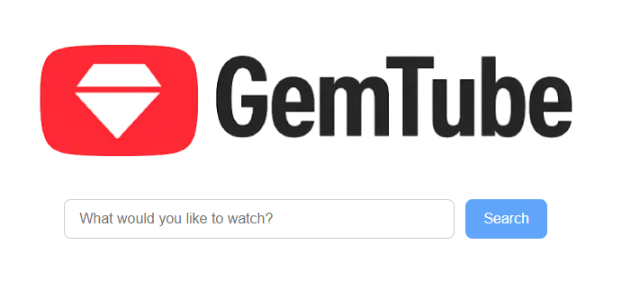
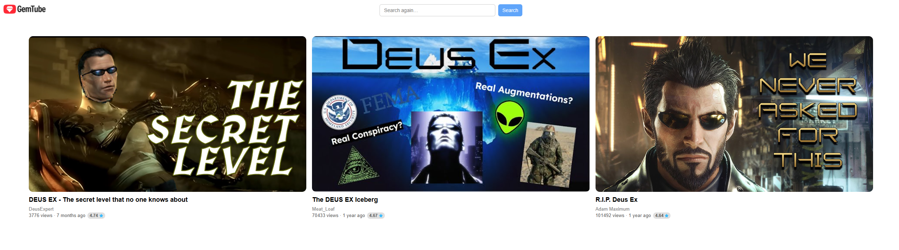

# 💎 GemTube – Hidden YouTube Gaming Gems!
Tired of YouTube recommending the same stale content on repeat?
Welcome to GemTube, your personal treasure hunter for high-quality gaming content from small creators.

Built as a lightweight web app paired with a powerful CLI tool, GemTube dives deep into the YouTube Data API to surface the hidden gems you actually want to watch—without wasting time on endless scrolling.

## 📚 Table of Contents

- [What is GemTube?](#what-is-gemtube)
- [Why GemTube?](#why-gemtube)
- [Who is it for?](#who-is-it-for)
- [Requirements](#requirements)
- [Features](#features)
- [Example Screenshots](#example-screenshots)
- [Installation & Usage](#installation--usage)
  - [Web (API Mode)](#-web-api-mode)
  - [CLI Mode](#-cli-mode)
- [Struggles & Learnings](#-struggles--learnings)
- [Future Roadmap](#-future-roadmap)
- [License](#-license)

## 💡 What is GemTube?
A discovery platform focused on finding high‑quality gaming videos from small creators (≤ 20K subs).
GemTube filters out the noise: no sponsor-shilled content, no kid-focused nonsense, and definitely no low-effort reaction filler.

You can explore GemTube through:

- 🌐 **Web App** *(Go-powered API)* – Search and binge directly in your browser with a slick responsive layout.
- 🛠 **CLI Tool** – Get fast, clean results right in your terminal. *Hackerman mode.*

## 🤔 Why GemTube?
Because life’s too short to scroll through YouTube’s algorithmic landfill.
Find genuine, passion-driven content that the algorithm keeps burying under corporate junk and trendy clickbait.
You bring the curiosity, GemTube handles the excavation.

## 🎮 Who is it for?
- Gamers hunting for passion-driven walkthroughs, reviews, or retrospectives from authentic small creators.
- Explorers who love diving deep into niche content without the algorithm bias.
- Developers & Tech Tinkerers interested in real-world search algorithms and minimalistic UX/UI design.

## 📦 Requirements
- Go 1.18+ (Backend API server)
- Node 16+ / npm (Frontend TypeScript build)
- YouTube Data API v3 Key (Yeah, Google’s API gatekeeping...)

## 🗝 How to Get Your API Key:
1. Head to [Google Cloud Console](https://console.cloud.google.com/).
2. Create or select a project.
3. Enable **YouTube Data API v3**.
4. Generate an API Key under **"Credentials"**.
5. Set it up and you're ready to go! 🎉
6. Create a `.env` file in the project root and add the following lines:
  - `YOUTUBE_API_KEY` – Your API key from Google Cloud.
  - `MODE` – Set to `CLI` for terminal mode or `API` for web mode.
```
YOUTUBE_API_KEY=YOUR_API_KEY
MODE=CLI
```

## ✨ Features
### 🎯 Precision Filters
- Gaming content only (Category ID: 20).
- No paid product placements—just pure, honest content.
- Videos between 4 to 50 minutes (because quality doesn’t mean dragging things out).
- English language preferred.
- Channel subscriber count capped at 20K subs.

### 📊 Custom Scoring Algorithm
- Prioritizes engagement, views, age of video, and channel size.
- Bye-bye, low-effort uploads. 👋

### 🌍 Web Mode
- Clean responsive grid
- One-click search—straight from homepage or video page.
- More underrated videos in suggested feed next to the video you're watching from the same channel!

### 💻 CLI Mode
- Straight-to-the-point terminal output with:
  - Video Title
  - Views / Likes / # of Comments
  - Duration / Channel / Score

## 📸 Example Screenshots

### Main Page  


### Feed Page  


## Video Page  


## 🚀 Installation & Usage
### 🌍 Web (API) Mode
```
# Clone this bad boy
git clone https://github.com/realquiller/GemTube.git
cd GemTube

# Open .env file and add/edit the following lines:
YOUTUBE_API_KEY="YOUR_API_KEY"
MODE=API

# Fire it up
go run main.go
```
Now head over to http://localhost:8080, type your favorite game, and let the gems roll in!

> 💡 **Advanced Tip:**  
> Want to tweak the default search behavior?  
> You can adjust `maxResults` and `targetResults` directly in `config.go` for API mode to fine-tune how deep GemTube digs for you.

### 💻 CLI Mode
```
# If you still haven't, clone this bad boy
git clone https://github.com/realquiller/GemTube.git
cd GemTube

# Open .env file and add/edit the following lines:
YOUTUBE_API_KEY="YOUR_API_KEY"
MODE=CLI

# Start digging with your own keywords
go run main.go --query="deus ex"

# Optional arguments:
--maxResults # Results per API page (default and recommended: 50)
--targetResults # Total desired results. GemTube will keep digging through pages until it finds at least this many videos or hits the API limit (10 pages).
```
Get the finest gems without leaving your terminal—Hackerman vibes fully unlocked.

## 🧩 Struggles & Learnings
- **Backend Battles**:
  Wrestled with YouTube API quotas, nested API calls, and unresolved quota errors. But hey, that’s how you learn robust error handling, right?

- **Frontend Adventures**:
  Came in with zero real frontend experience and thought, “How hard can it be?” Well… after about 300 ChatGPT prompts and endless retries, I found out. 😅
  But through the chaos, I learned how to actually wire things up, connect backend APIs to the frontend, and realized that TypeScript isn’t magic, it still needs to be compiled into JavaScript before the browser understands it.
  This project didn’t just teach me how to fight the DOM directly with Vanilla JS—it gave me a solid reason to learn plain JavaScript properly before diving deeper into frontend frameworks.

- **UX/UI Revelations**:
  My first time using Figma in programming project. Spacing, typography, and accessibility? Turns out they’re kind of a big deal.
  
- **Keeping Sane**:
  Managed API & CLI modes in one codebase, dealt with caching hell, and figured out a smooth workflow between the two worlds.

## 🗺 Future Roadmap
- **📚 Discovery Modes**:
  Add new filters like “best of big channels” based on view/sub ratios.
- **❤️ User Feedback & Favorites**:
  Like/gem buttons with personalized recommendations (backed by a lightweight DB).
- **🔌 Browser Extension**:
  Instant gem recommendations right on YouTube.
- **👤 User Profiles & Auth**:
  Save your favorite gems and build your personal collection.
- **🌙 Dark Mode Toggle**:
  Because it’s practically a human right at this point.

> *Note: Roadmap may depend on how generous (or stingy) Google’s API quotas feel.*

## 📜 License
Released under the MIT License.
Fork it, break it, fix it, improve it, just toss a star ⭐ if it makes your day!